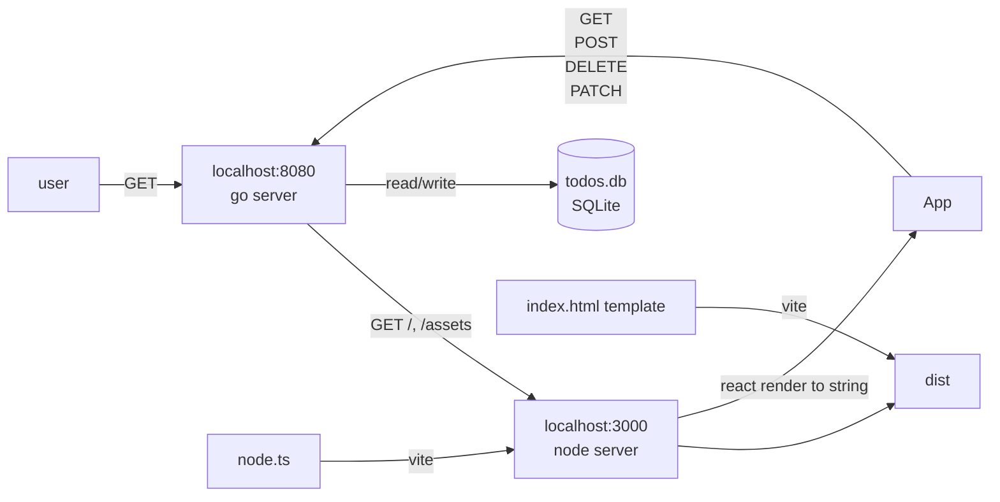

```mermaid
graph LR;
    A[user] -- GET--> B[localhost:8080 <br>go server]
    B -- GET /, /assets--> C[localhost:3000 <br> node server]
    B -- read/write --> H[(todos.db <br> SQLite)]
    C --> D["dist"]
    C -- react render to string --> E["App"]
    F[node.ts] -- vite --> C
    E["App"] -- GET <br>  POST  <br> DELETE <br> PATCH --> B
    G[index.html template] -- vite--> D


```