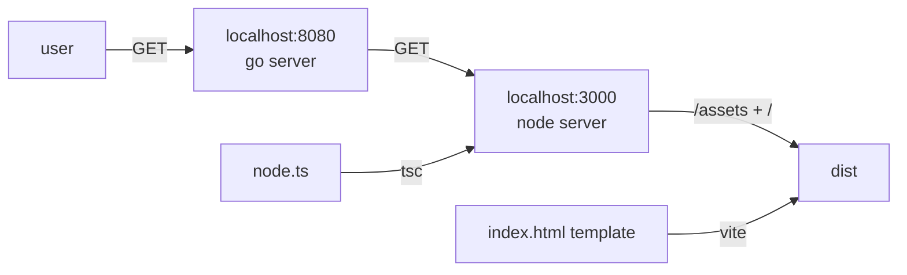

```mermaid
graph LR;
    A[user] -- GET --> B[localhost:8080 <br>go server]
    B -- GET --> C[localhost:3000 <br> node server]
    C -- /assets + / --> D["dist"]
    F[node.ts] -- tsc --> C
    G[index.html template] -- vite--> D

```